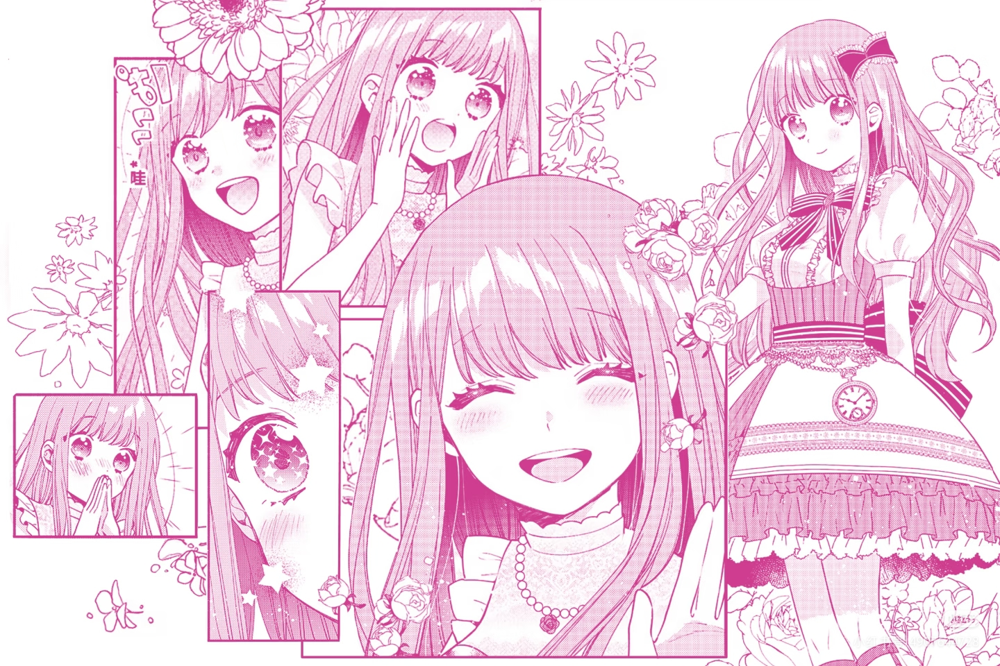

### 1. 文章头图

上面的图片就是我们在配置区指定的 `image` 头图，它会在首页卡片和文章顶部显示。

### 2. 文章内插图

你也可以在 Markdown 的内容区，像使用普通图片一样插入它：

### 3. 公式测试

顺手再测试一下我们之前的公式渲染，看看背景有没有消失：

$$\tau_m \frac{dU(t)}{dt} = -(U(t) - U_{rest}) + R I(t)$$

写完了，快去预览一下吧！